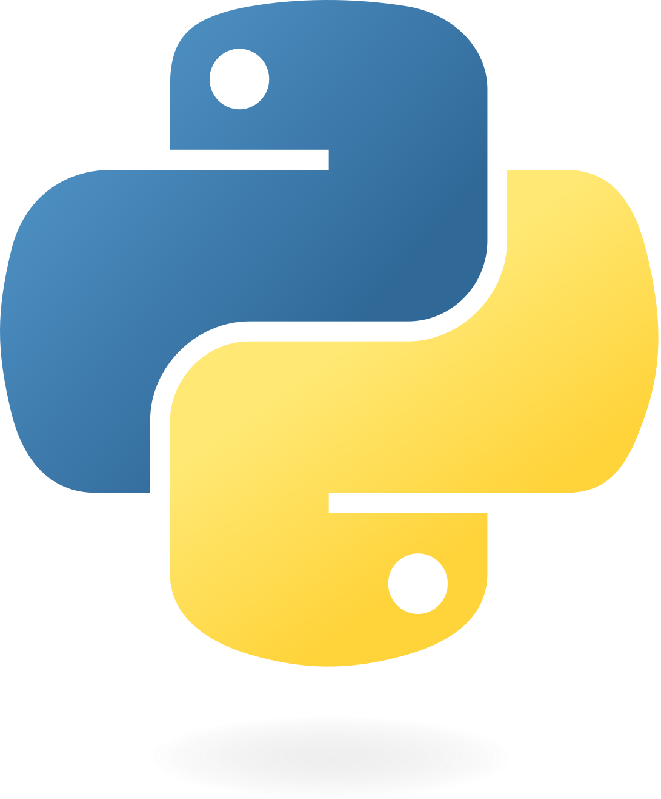

<p align="center">
    
</p>
<br>
<div align="center">


<br>
<br>


<br>
<br>


<br>
<br>

[](https://opensource.org/licenses/MIT)
<br>

</div>

# _Learn Python_

> All you need is Python and you can read that here.

This repository contains a collection of Julia code samples on various topics. Here you will find examples of basic to advanced Julia concepts.

### Installation

1. **Clone repository**<br>
   Clone the repository to a local directory:
    ```bash
    git clone https://github.com/Peharge/learn-python
    ```
2. **Change directory**<br>
   Navigate to the project directory:
    ```bash
    cd learn-python
    ```
   
3. **Have fun**

## Structure

- `Basic-Python/` - Basic Python examples
- `Advanced-Python/` - Advanced Python examples
- `Deep-Learning/` - Deep Learning Python examples

I think you got it!

## Join in

1. Fork the repository
2. Create a branch
3. Add your code example
4. Create a pull request

## License

This project is licensed under the [MIT License](LICENSE).